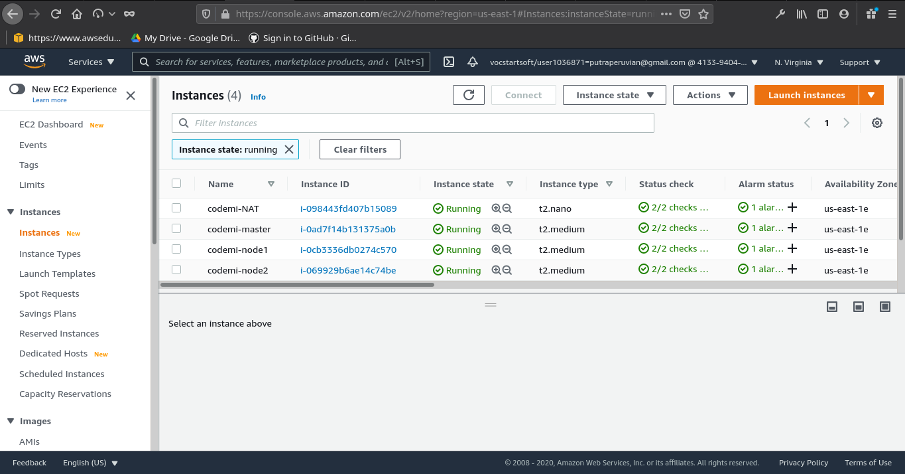
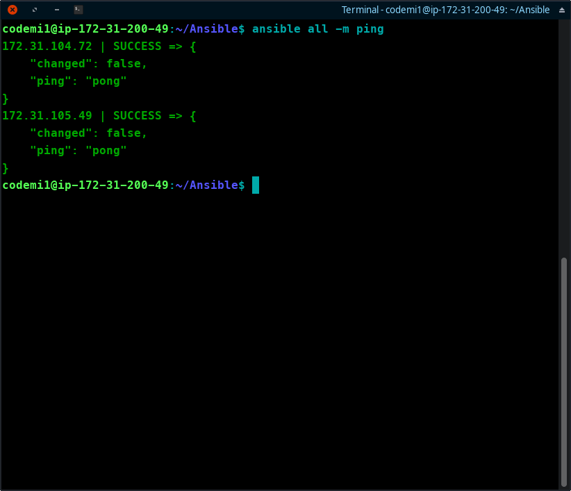
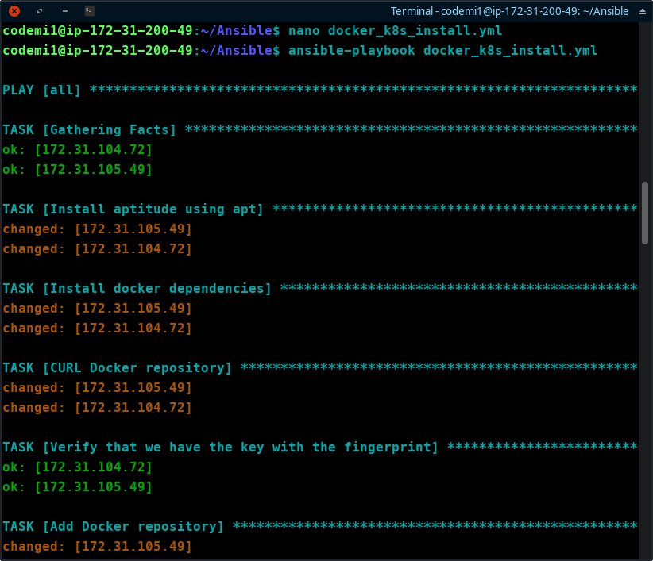
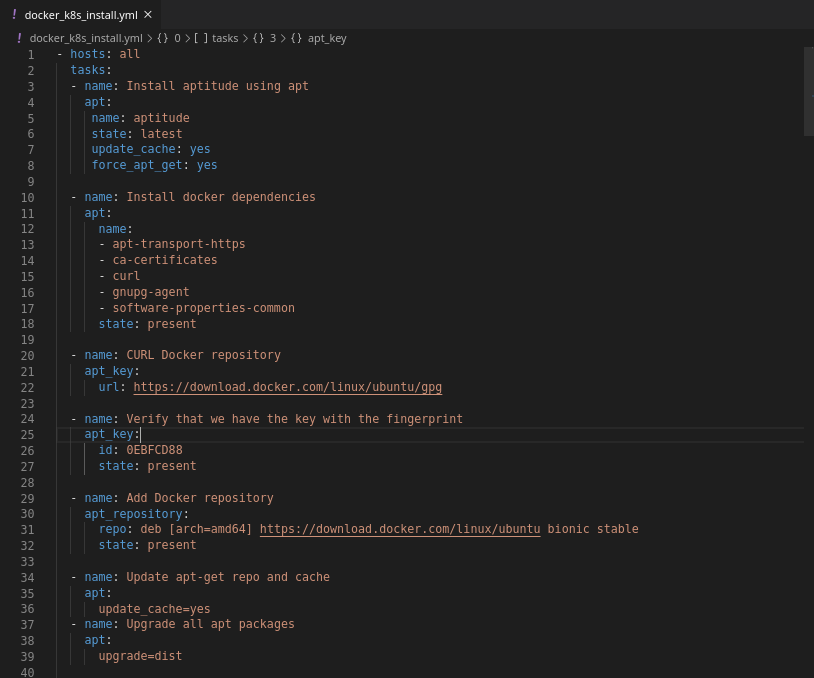
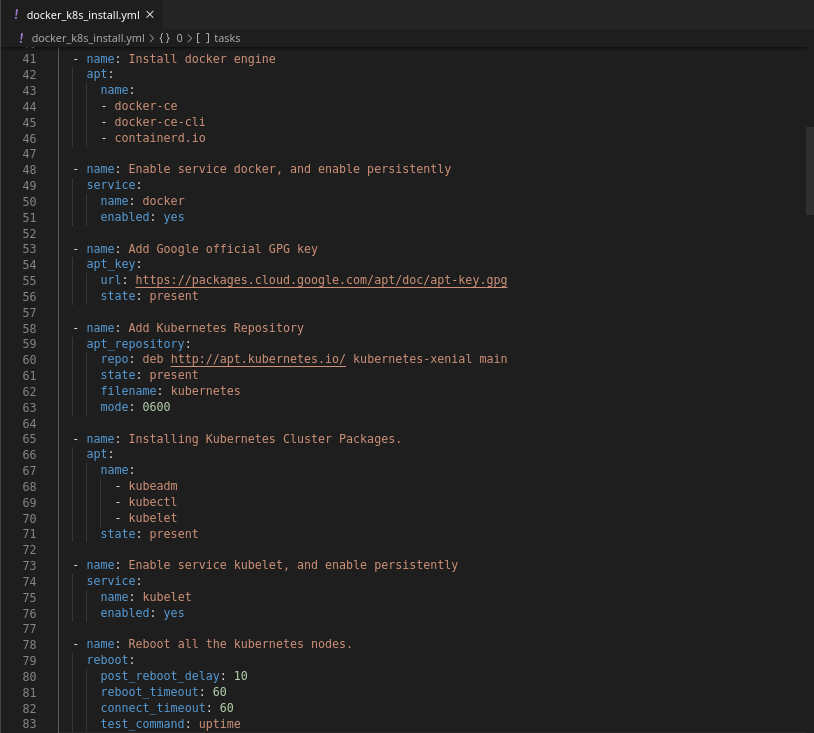
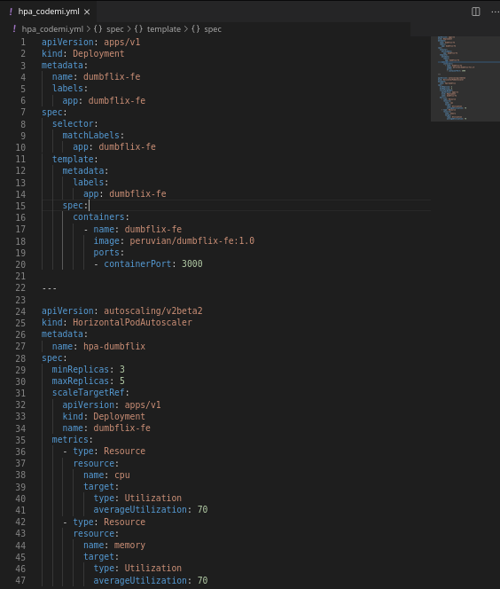
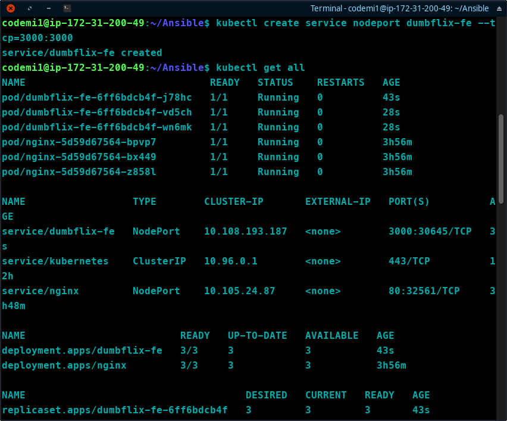
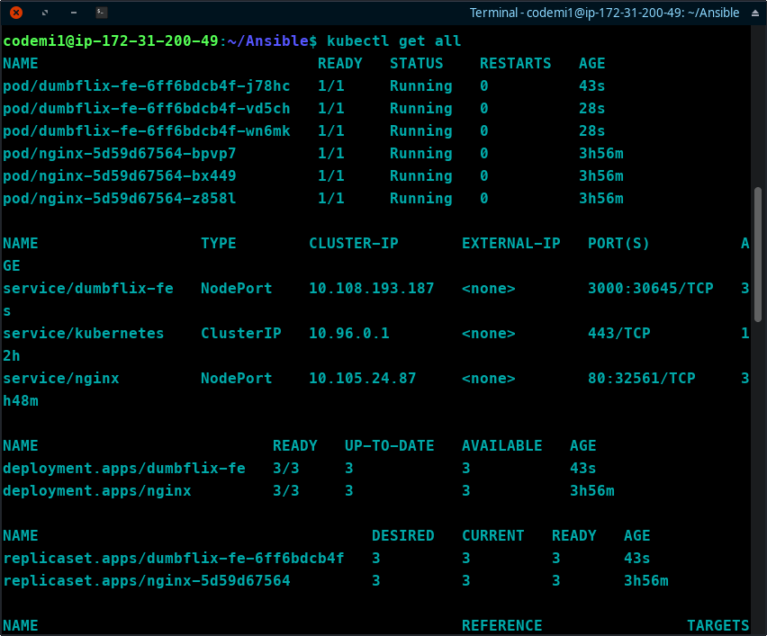
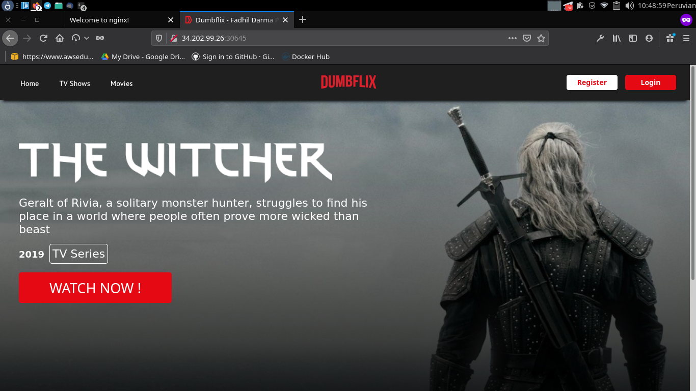

## Online Test Codemi

### Deploying Aplikasi 

- `Nama Aplikasi : DUMBFLIX`
- `Bahasa        : Javascript`
- `Server        : Amazon Web Server`
- `Tools         : Ansible, Docker, Kubernetes`
                  
### Step by Step

Pada kesempatan kali ini saya mendeploy sebuah aplikasi kedalam Amazon Web Server(AWS) menggunakan Kubernetes dengan implementasi Horizontal Pod Autoscale dan CPU Memory metrics.

#### Step 1. Server

Untuk server yang saya gunakan adalah Amazon Web Server(AWS) dengan menyiapkan 3 instance baru dengan spesifikasi sbb : 

- Codemi-master : Ubuntu server 18.04 LTS t2.medium (2 core, 4GiB Memory, 8GiB SSD) Public Subnet
- Codemi-node1  : Ubuntu server 18.04 LTS t2.medium (2 core, 4GiB Memory, 8GiB SSD) Private Subnet
- Codemi-node2  : Ubuntu server 18.04 LTS t2.medium (2 core, 4GiB Memory, 8GiB SSD) Private Subnet

Ketiga server tersebut berada dalam 1 VPC NAT instance.

#### Step 2. Server Konfigurasi

Untuk konfigurasi di ketiga server saya menggunakan Ansible agar proses installasi berjalan lebih cepat dengan `Codemi-master` sebagai server induk

Proses installasi docker dan kubernetes menggunakan Ansible-playbook

Ansible-playbook

#### Step 3. Deploying Aplikasi

Aplikasi ini sudah mengimplementasikan Horizontal Pod Autoscale dan CPU Memory Metric dengan konfigurasi sbb :

Proses deploying aplikasi

Hasil deploying aplikasi

#### Penutup

Terimakasih kepada pihak codemi yang telah memberikan saya kesempatan untuk mengerjakan test online ini.

Jika ada yang ingin disampaikan atau ingin di tanyakan bisa menghubungi saya pada alamat berikut :
- Nama : Tian Putra Nuhcahya
- Email : tianputra33@yahoo.com
- Mobile : 082120320330